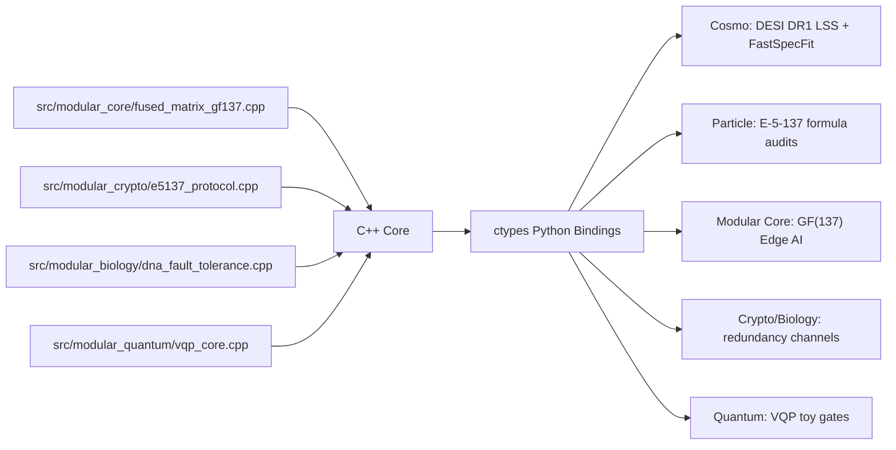

# E-5-137 Research Sandbox

This repository is a Python/C++ research sandbox for three related tracks:

- a reproducible DESI DR1 directional-gradient null-result pipeline;
- compact particle-parameter audits for the E-5-137 numerical model;
- experimental GF(137) compute kernels for edge inference, redundancy, crypto
  toys, biology-inspired repair channels, and virtual quantum gates.

The project is intentionally explicit about scope. The DESI branch is an
observational null result. The particle branch is phenomenological
bookkeeping, not a Standard Model replacement. The GF(137) systems branch is an
engineering sandbox, not audited cryptography, AGI, or physical quantum
computing.

## DOI Records

- Sandbox software/reproducibility DOI:
  [`10.5281/zenodo.20436776`](https://doi.org/10.5281/zenodo.20436776)
- DESI DR1 directional-gradient preprint DOI:
  [`10.5281/zenodo.20436979`](https://doi.org/10.5281/zenodo.20436979)
- GF(137) edge-inference preprint DOI:
  [`10.5281/zenodo.20437242`](https://doi.org/10.5281/zenodo.20437242)
- Lepton/hadron mass-parameterization preprint DOI:
  [`10.5281/zenodo.20437275`](https://doi.org/10.5281/zenodo.20437275)

## Architecture



Key Python modules:

- `src/cosmo_gradient/pipeline.py`: DESI density-gradient pipeline.
- `src/cosmo_gradient/fastspecfit.py`: DESI FastSpecFit residual-gradient
  pipeline.
- `src/cosmo_gradient/theory.py`: deterministic particle/cosmology formula
  audits.
- `src/cosmo_gradient/modular_core.py`: GF(137) neural-kernel bindings.
- `src/cosmo_gradient/modular_crypto.py`: toy GF(137) redundancy/encryption
  bindings.
- `src/cosmo_gradient/modular_biology.py`: synthetic fault-tolerance channel.
- `src/cosmo_gradient/modular_quantum.py`: compact VQP toy-gate bindings.

## Installation

The project targets Python 3.13 and uses `uv`.

```bash
cd cosmo_genesis_gradient
uv sync --extra test
```

Optional scientific extras for real DESI work:

```bash
uv sync --extra test --extra plot --extra desi --extra healpix --extra science
```

The C++ kernels are compiled lazily by the Python bindings using `clang++` or
`g++`. Build logs are written under `build/`.

## Test Suite

The active test matrix is compressed to five orthogonal super-tests:

```bash
uv run pytest
```

Expected output:

```text
tests/test_super_matrix.py: 5
.....                                                                    [100%]
5 passed
```

The previous 137-test matrix is preserved in `tests_legacy_137/` for audit
history, but it is no longer collected by pytest.

## DESI DR1 Null Result

The observational branch tests the null hypothesis:

> After correction for survey geometry, selection functions, random catalogs,
> and available systematics templates, the tested DESI DR1 tracer observables
> are compatible with statistical isotropy.

Primary output:

- `papers/desi_dr1_directional_gradient_null_result.md`
- DESI software package DOI: `10.5281/zenodo.20433884`
- Preprint DOI: `10.5281/zenodo.20436979`

Representative result:

- LRG `DN4000_MODEL`, `0.4 <= z < 0.6`, NGC:
  block-null `p = 0.409`.
- High-redshift QSO branch:
  no robust directional axis; controlled tests remain null.

This does not prove exact cosmic isotropy. It reports an active null for the
implemented DR1 tests.

## Particle Formula Audits

The particle branch records compact numerical formula audits around the
discrete basis

```text
P = {2, 3, 5, 13, 137}, N = 5, D = 26, F26 = 121393.
```

Selected Phase 9 values:

| Observable | Model value | Residual |
|---|---:|---:|
| `m_mu / m_e` | `206.76822` | `-0.29 ppm` |
| `m_tau / m_e` | `3477.22820` | `-0.022 ppm` |
| `m_pi0` | `134.976797 MeV` | `-0.020995 ppm` |
| `M_p / m_e` | `1836.152489795` | `-0.098658 ppm` |
| `m_tau_prime` | `47.417731 GeV` | benchmark |
| `m_nu_tau_prime` | `1.556646 GeV` | benchmark |

Important guardrail: these are phenomenological parameterizations. They are
not derivations from QCD, electroweak theory, or a Lagrangian.

## GF(137) Edge-AI Kernel

The modular inference kernel stores weights as `uint8` residues in
`Z/137Z` and fuses:

```text
matrix multiply -> mod 137 -> threshold >= 42
```

Final shootout rows:

| Backend | Memory KB | 1000 forward ms | Notes |
|---|---:|---:|---|
| float32 NumPy MLP | `6.50391` | `58.7784` | baseline |
| GF(137) compact uint8 | `1.62793` | `582.904` | smallest storage, Python overhead |
| GF(137) C++ fused uint8 | `1.62793` | `40.1530` | Python-call latency path |
| GF(137) C++ NEON native loop | `1.62793` | `12.1055` | throughput path |
| JAX JIT CPU | `6.50391` | `42.4758` | float compute cache |

Summary:

- memory reduction vs float32: about `4x`;
- throughput speedup vs NumPy float32 baseline: about `4.86x`;
- compact model size: `1.63 KB` vs `6.50 KB`.

## Virtual Quantum Processor Toy

The VQP module represents `n` virtual qubits as `n * 26` GF(137) phase lanes,
not as a full `2^n` complex state vector. That gives a compact deterministic
gate emulator with linear storage, but it is not a physical quantum simulator.

Phase 9 benchmark against a local NumPy complex128 state-vector baseline:

| Qubits | VQP ms | Float ms | Speedup | Memory ratio |
|---:|---:|---:|---:|---:|
| 8 | `0.072708` | `45.932166` | `631.73x` | `19.69x` |
| 10 | `0.006709` | `49.136333` | `7323.96x` | `63.02x` |
| 12 | `0.012459` | `37.761125` | `3030.83x` | `210.05x` |
| 16 | `0.019291` | `94.975167` | `4923.29x` | `2520.62x` |

The VQP speedup comes from compact representation and idempotent toy-semantics
collapse. It should not be described as real quantum advantage.

## Papers and Reports

Publication-oriented files:

- `papers/desi_dr1_directional_gradient_null_result.md`
- `outputs/papers/lepton_mass_matrix.tex`
- `outputs/papers/lepton_mass_matrix.pdf`
- `outputs/papers/lepton_mass_matrix_ru.tex`
- `outputs/papers/lepton_mass_matrix_ru.pdf`
- `outputs/papers/modular_edge_ai.tex`
- `outputs/papers/modular_edge_ai.pdf`
- `outputs/papers/modular_edge_ai_ru.tex`
- `outputs/papers/modular_edge_ai_ru.pdf`

Associated preprints:

- DESI null result: `10.5281/zenodo.20436979`
- GF(137) edge inference: `10.5281/zenodo.20437242`
- Lepton/hadron mass parameterization: `10.5281/zenodo.20437275`

Engineering and audit reports:

- `outputs/reports/cpp_kernel_benchmark.md`
- `outputs/reports/virtual_quantum_processor_manifest.md`
- `outputs/reports/phase9_cross_phase_optimization.md`
- `outputs/reports/super_test_matrix_compression.md`
- `outputs/reports/dna_quantum_immortality_manifest.md`

## Data Layout

Large DESI files are intentionally kept out of normal repository operations.
Use external raw roots for SSD-backed datasets:

```yaml
paths:
  data_raw: data/raw
  additional_raw_roots:
    - /Volumes/COSMO_T7/cosmo_genesis_gradient/raw
```

Normal tests and GF(137) benchmarks do not require downloading DESI data.

## License

MIT. Scientific claims, if reused, should preserve the caveats above and cite
the specific report or DOI used.
